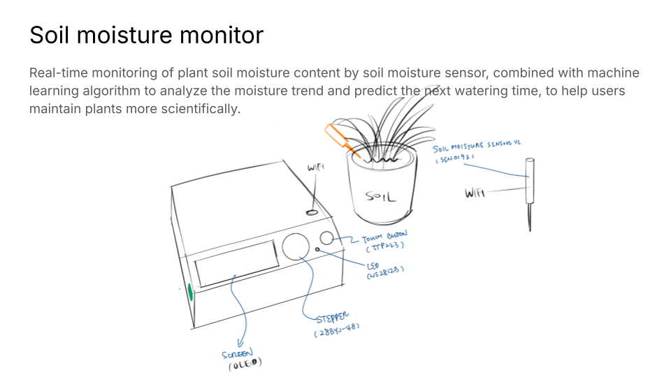
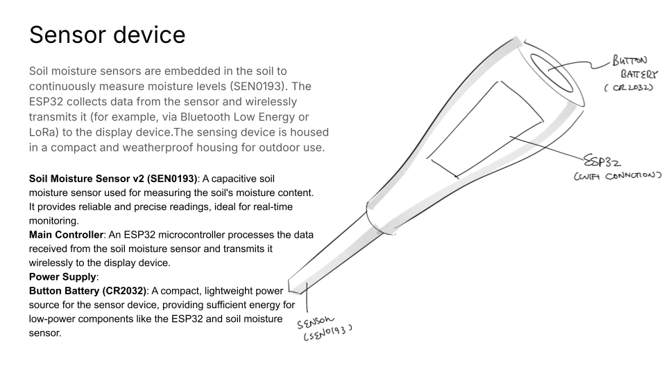
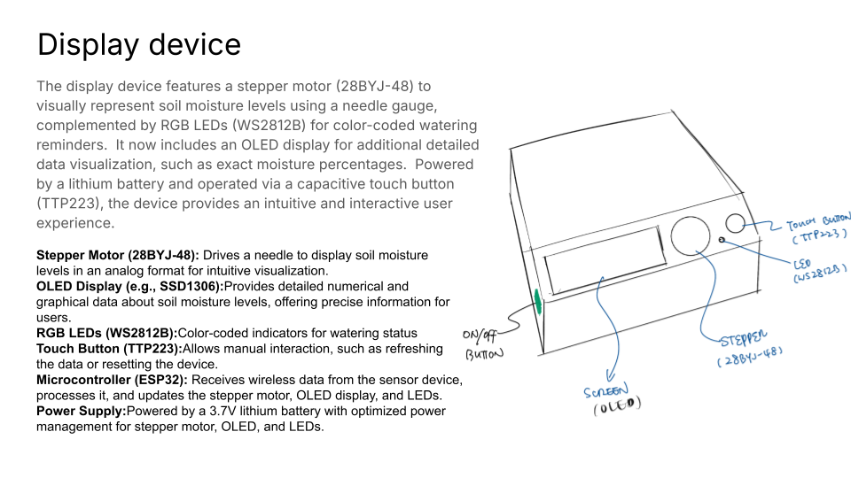

# Final-project
# Portable Soil Monitor

## Project Overview
The Portable Soil Monitor is a device designed for real-time monitoring of soil moisture. It uses a soil moisture sensor to collect data, analyzes trends with a machine learning algorithm, and predicts the next watering time to help users scientifically manage their plants.

---

## Features
- Real-time monitoring of soil moisture levels.
- Machine learning-based trend analysis to predict dryness for the next 1–2 days.
- Stepper motor-driven needle to display soil moisture status.
- LED indicators to provide watering reminders.
- Touch-sensitive button for manual data refresh.
- Solar-powered with backup lithium battery for continuous operation.

---

## Hardware Design

### 1. Overall Sketch

---

### 2. Sensing Device
- **Sensor**: DFRobot Capacitive Soil Moisture Sensor v2 (SEN0193).
- **Functionality**: Measures soil moisture levels and transmits data wirelessly to the main control chip (ESP32).
- **Power**: Solar panel as the primary power source, with a built-in lithium battery as backup.
- **Diagram**:

---

### 3. Display Device
- **Key Components**:
  - **Stepper Motor**: 28BYJ-48, drives a needle to show the soil moisture level.
  - **LEDs**: WS2812B RGB LEDs to indicate watering reminders.
  - **Touch Button**: TTP223 capacitive touch module for manual refresh.
- **Power**: Powered by a 3.7V lithium battery with optimized power consumption for stepper motors and LEDs.
- **Diagram**: *(Insert detailed sketch of the display device here.)*

---

## Communication and Workflow

### 1. Device Communication Flow

### 2. Functional Diagram

---

## Datasheets
The datasheets for all components used in this project can be found in the `datasheets/` folder. Key components include:
- **Soil Moisture Sensor**: SEN0193.
- **Wireless Communication Module**: ESP32-WROOM-32.
- **Stepper Motor**: 28BYJ-48 with ULN2003 driver.
- **RGB LEDs**: WS2812B.
- **Touch Button**: TTP223.
- **Power Management Module**: TP4056.

---

## How to Run the Project
1. Assemble all hardware components according to the design.
2. Upload the code to the ESP32 microcontroller.
3. Power on the device and let it begin monitoring soil moisture and displaying the results.

---

## Repository Structure
